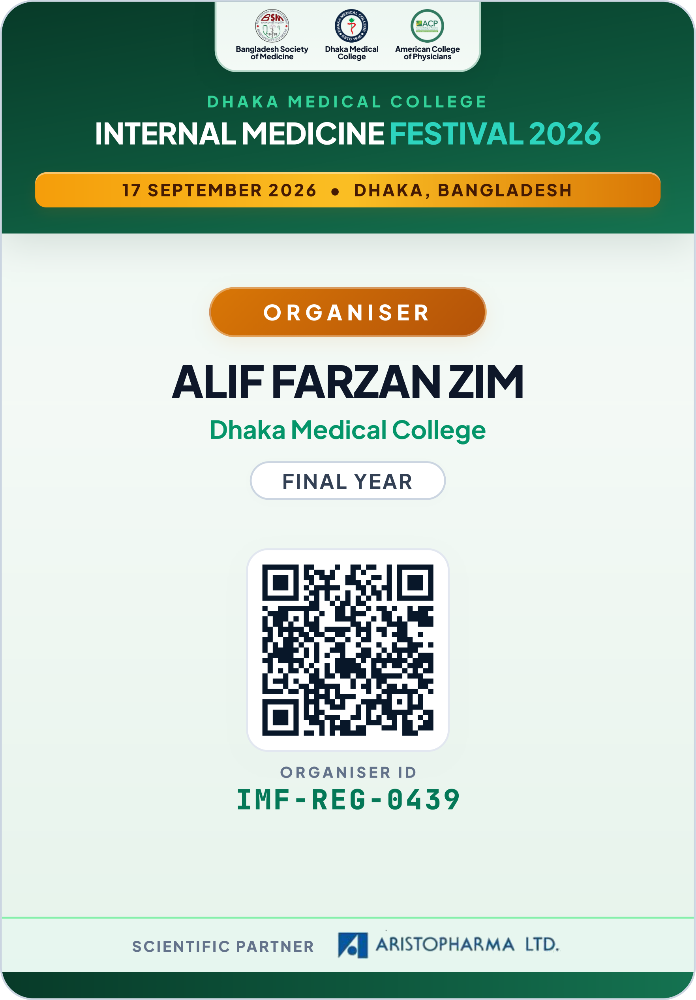
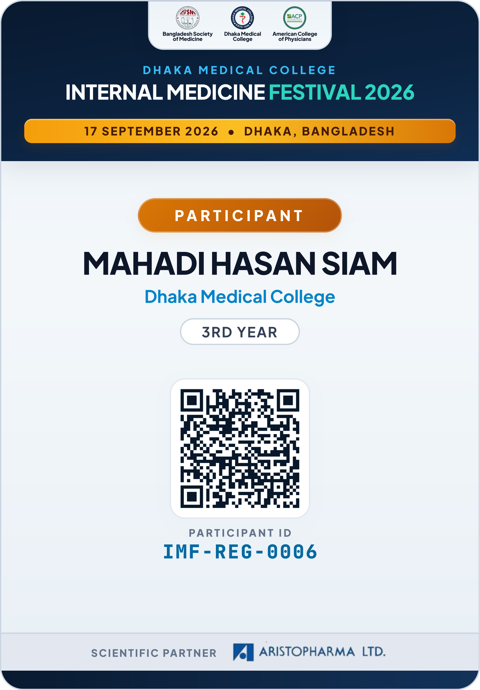

# Internal Medicine Festival 2026 (IMF 2026)

[](https://pages.cloudflare.com/)
[](https://react.dev/)
[](https://vitejs.dev/)
[](https://developers.cloudflare.com/d1/)
[](https://developers.cloudflare.com/r2/)

> **“Inspiring the Future of Internal Medicine”**  
> Organized by **DMC IMIG** • **ACP Bangladesh Chapter** • **Bangladesh Society of Medicine (BSM)**

---

## 📌 Event Highlights

| Detail | Information |
|---|---|
| **📅 Date** | 17 September 2026 |
| **👨‍⚕️ Eligibility** | 1st Year to Final-Year Medical Students |
| **💰 Registration Fee** | **FREE** |
| **📝 Registration Deadline** | 14 September 2026 |
| **🏛️ Organizing Bodies** | Dhaka Medical College Internal Medicine Interest Group (DMC IMIG), American College of Physicians (ACP) Bangladesh Chapter, Bangladesh Society of Medicine (BSM) |

---

## 🩺 Event Activities & Segments

- **Scientific Seminar / CME**: Keynotes from leading national and international internists.
- **Clinical Reasoning Competition**: Interactive clinical case challenges for budding diagnosticians.
- **Medical Quiz Competition & Olympiad**: Fast-paced medical knowledge competitions across batches.
- **Career Counselling & Mental Health Sessions**: Guidance on residency pathways, USMLE, MRCP, FCPS, and student wellness.
- **Scientific Abstract Presentations**: Oral & poster presentations of original research and rare clinical case reports.

---

## 🪪 Conference Chest Cards & ID Badges

Official press-ready credentials designed for festival delegates and the organizing committee. Badges feature high-security dynamic QR verification, institutional seals, and distinctive executive color palettes (Deep Forest Green for Organisers, Executive Navy for Participants).

<table>
  <tr>
    <td align="center" width="50%">
      <b>Organiser Badge</b><br><br>
      
      <br><br>
      <sub><b>Alif Farzan Zim</b> &bull; Organiser (IMF-REG-0439)</sub>
    </td>
    <td align="center" width="50%">
      <b>Participant Badge</b><br><br>
      
      <br><br>
      <sub><b>Mahadi Hasan Siam</b> &bull; Participant (IMF-REG-0006)</sub>
    </td>
  </tr>
</table>

### 🔍 Badge Verification
Each chest card features a tamper-proof cryptographic QR code verified in real-time by the Cloudflare Edge verification engine.

Direct verification link for Alif Farzan Zim:  
https://imf2026.pages.dev/verify?reg=IMF-REG-0439&sig=aea2e51b

---

## ⚡ Technical Architecture

This application is built as a zero-cost, high-performance, serverless full-stack web platform powered by Cloudflare:

```
┌─────────────────────────────────────────────────────────────┐
│                    IMF 2026 Client                          │
│        (React 18 + Vite + Tailwind CSS + SheetJS)           │
└──────────────┬───────────────────────────────┬──────────────┘
               │                               │
       API Requests                    Direct / Proxied Upload
               │                               │
┌──────────────▼───────────────────────────────▼──────────────┐
│             Cloudflare Pages Functions (Edge)               │
│  - /api/register          - /api/get-upload-url             │
│  - /api/submit-abstract   - /api/upload-direct              │
│  - /api/admin/login       - /api/admin/records              │
│  - /api/admin/file        - /api/admin/download-all         │
└──────────────┬───────────────────────────────┬──────────────┘
               │                               │
        SQLite Queries                  Object Storage
               │                               │
┌──────────────▼──────────────┐ ┌──────────────▼──────────────┐
│     Cloudflare D1 DB        │ │     Cloudflare R2 Bucket    │
│      (`imf-db`)             │ │     (`imf-abstracts`)       │
│  - registrations table      │ │  - Research abstracts (PDF) │
│  - abstracts table          │ │  - Case reports (DOCX)      │
│  - indexes & constraints    │ │  - Presentation slide decks │
└─────────────────────────────┘ └─────────────────────────────┘
```

### Core Technologies
- **Frontend**: React 18 with Vite, CSS design tokens, Lucide React icons.
- **Serverless Runtime**: Cloudflare Pages Functions running on V8 isolates worldwide.
- **Database**: Cloudflare D1 Serverless SQL (`imf-db`).
- **Object Storage**: Cloudflare R2 (`imf-abstracts`) with zero egress fees and presigned upload support.
- **Data Exporting**: Built-in Excel (`.xlsx`), CSV, and complete ZIP archive generation for submitted abstracts.

---

## 📂 Repository Structure

```
imf2026/
├── functions/                    # Cloudflare Pages serverless endpoints
│   └── api/
│       ├── register.js           # Registration submission & D1 storage
│       ├── get-upload-url.js     # Presigned S3/direct upload URL generator
│       ├── upload-direct.js      # Streaming direct R2 upload handler
│       ├── submit-abstract.js    # Abstract submission & D1 record creation
│       └── admin/
│           ├── _auth.js          # Web Crypto HMAC-SHA256 JWT utility
│           ├── login.js          # Admin credentials verification
│           ├── records.js        # Admin records query, edit, and deletion
│           ├── file.js           # Single file download streamer
│           └── download-all.js   # Bulk ZIP download of all abstract files
├── src/
│   ├── assets/                   # SVG Icons & static graphics
│   ├── components/
│   │   ├── Header.js             # Sticky frosted navigation bar
│   │   ├── Hero.js               # Event hero banner, countdown & CTA
│   │   ├── RegisterModal.js      # Multi-section registration modal
│   │   ├── AbstractModal.js      # 4-step wizard abstract submission form
│   │   ├── SuccessCard.js        # ID generation confirmation & copy badge
│   │   └── AdminTable.js         # Interactive admin dashboard with search & export
│   ├── pages/
│   │   ├── Home.js               # Main public festival portal
│   │   └── Admin.js              # Password-protected admin control panel
│   ├── styles/                   # Custom styling & Tailwind utilities
│   ├── utils/                    # Centralized API fetch wrapper & XLSX export
│   ├── App.js                    # Hash-based client router
│   └── main.jsx                  # React DOM mount point
├── schema.sql                    # Cloudflare D1 SQL schema definition
├── wrangler.toml                 # Cloudflare Pages, D1, and R2 configuration
├── package.json                  # Dependencies and build scripts
├── SETUP.md                      # Complete deployment & configuration manual
└── README.md                     # Project overview and documentation
```

---

## 🚀 Getting Started

### 1. Clone the repository
```bash
git clone https://github.com/aliffarzanzim/imf2026.git
cd imf2026
```

### 2. Install dependencies
```bash
npm install
```

### 3. Start development server
```bash
npm run dev
```

### 4. Setup Cloudflare D1 & R2
Refer to **[SETUP.md](file:///c:/Users/Alif%20Farzan%20Zim/GitHub/imf2026/SETUP.md)** for detailed, step-by-step instructions on:
- Initializing the `imf-db` D1 database
- Executing `schema.sql` migrations
- Creating the `imf-abstracts` R2 bucket
- Configuring secrets and deploying to Cloudflare Pages

---

## 🔒 Security & Privacy

- **No Secrets in Source Control**: All sensitive credentials (`ADMIN_PASSWORD`, Cloudflare tokens) are managed via Wrangler CLI secrets or Cloudflare Pages Dashboard environment variables.
- **Client-Side Privacy**: Personal data is protected with restricted admin routes and tamper-proof HMAC-SHA256 edge tokens.

---

## 📄 License
This project is open-source under the MIT License for educational and non-profit medical conference management.
